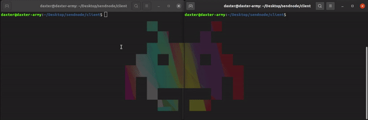

# Transnoder
Made with the magic of Node.js and sockets.io, transnoder is a command line interface tool which enables you to send any kind of file directly from cli.

## ✨ Screenshot
<p align="center">
  
</p>
https://raw.githubusercontent.com/daxter-army/transnoder-cli/main/screenshots/demo-video.mp4
  
## ⭐ Features
- You can send any file, without going anywhere, right from your fav terminal
- Do not store your files like others, it just redirects it to it's destination
- Data is sent using base64 encoding
- Saves your time

## ⚒ Technologies
The Project is created with:

- Node.js
- Sockets.io
- Express

## How to use
- **NOTE -** to run on localhost, go to _client/client.js_ and change the value of url to **http://localhost:<port_number>**
* To run this project, **Nodejs should be installed on your system, if not you can download it from [here](https://nodejs.org/en/)**

## 🐱‍🏍 Run
**Server**
- After cloning, go to server and client directory, and hit

```js
npm install
```

- Go to server directory and type

```js
npm run start
```

This will start the server, and this server will be the mediator between both our clients, i.e sender and receiver

**Client**
- Client as **receiver**, **should be run first.**
- Go to Client directory and hit

```js
node client.js <user_name>
```

- **user_name:** it is alphanumeric string, must be given by user, to make unique user connection.

<hr/>

- Client as receiver, **should be run after receiver script, when terminal is saying this:**

```js
Ready to receive data...
```

- Go to Client directory and hit, in a different terminal

```js
node client.js <user_name> <file_name>
```

where,

- **user_name:** it is an alphanumeric string with max length of 10 characters, must be given by user, to make unique user connection.

- **file_name:** it is the desired file that is supposed to be send by the sender, should be in the directory of this current file. **That means you need to move your target file here, to send before launching the script.**

* On successfull completion, you will see the new file created in the current working directory.

## 🛵 Things in motion
- It supports sending any kind of file, whether audio, video, text, any file.
- Messaging can also be implemented with this, and is currently in development.
- The data is sent in chunks, in base64 encoded string, which can also be encypted and then send, by using any cipher algo of your choice.

## ℹ Notice
- Currently, it sends files globally, i.e all the receivers who are connected with the sender at a particular instance, are sent the file.
- It do not checks whether, the receiver is present or not, it just sends the file, but receiver should be there in order to receive the file.
- We can also check for a particular file that, does it exists or not.

## 🗄 License
MIT License
